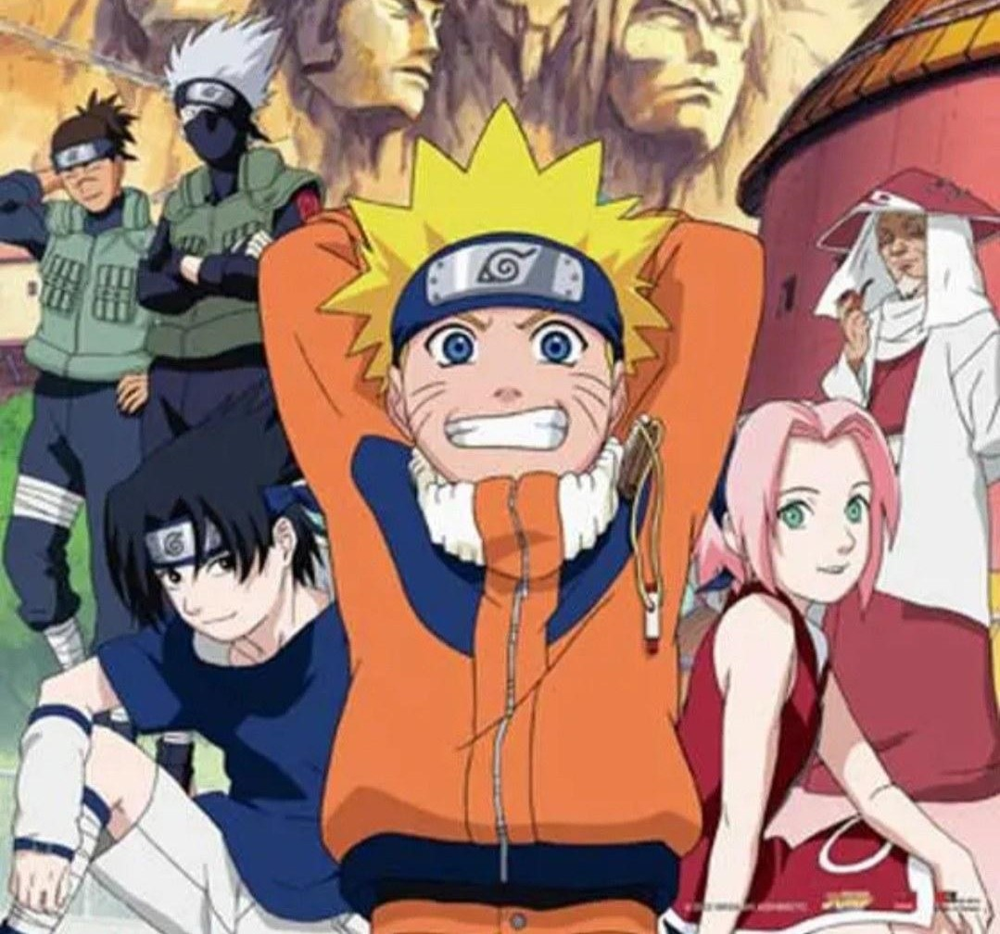

  
  

# 🌀 Exploring Naruto Through Data Science

-- This is a full pipeline project that combines scraping, cleaning, analysis, visualization, and modelling — all based on the legendary world of Naruto 🍥.

## 🚀 Project Pipeline

### 1. 🔎 Web Scraping with Scrapy
- Scraped character and jutsu data from Naruto-related websites
- Exported into structured `.jsonl` format for NLP processing

### 2. 🧠 Named Entity Recognition (NER) with spaCy
- Extracted characters, locations, clans, and jutsu names from episode scripts
- Built custom pipelines to handle anime-specific tokens and patterns

### 3. 🕸️ Character Network Graph
- Built a character interaction graph using `networkx` and `pyvis`
- Visualized node connectivity to identify key figures (yes, Naruto's popular — but who really *connects* the story?)

### 4. 🧪 Theme Classification with Zero-shot Learning
- Used Hugging Face zero-shot classifiers to detect main themes in dialogue
- Examples: friendship, betrayal, ambition, legacy

### 5. 🤖 Jutsu Classification with Transformers
- Fine-tuned a `distilbert-base-uncased` model to classify jutsu into:
  - `Ninjutsu`, `Taijutsu`, or `Genjutsu`
- Trained on titles and descriptions using HuggingFace `transformers` + PyTorch

---

## 🧠 Skills Learned & Implemented

- Web scraping & data wrangling
- NLP (Named Entity Recognition, Zero-shot Learning)
- Transformer model fine-tuning (BERT)
- Graph theory & visual analytics
- End-to-end pipeline creation
